<div align="center">

<!-- ═══════════════════════════════════════════════════════════════════════════
     HERO BANNER - Save as: assets/hero-banner.svg
     ═══════════════════════════════════════════════════════════════════════════ -->



<!-- ═══════════════════════════════════════════════════════════════════════════
     ANIMATED IDENTITY STATEMENT - Save as: assets/identity-morph.svg  
     ═══════════════════════════════════════════════════════════════════════════ -->


</div>

<!-- ═══════════════════════════════════════════════════════════════════════════
     DIVIDER - Save as: assets/divider-stars.svg
     ═══════════════════════════════════════════════════════════════════════════ -->


<div align="center">

<!-- ═══════════════════════════════════════════════════════════════════════════
     SYSTEM OVERVIEW - Save as: assets/system-overview.svg
     ═══════════════════════════════════════════════════════════════════════════ -->


</div>


<div align="center">

<!-- ═══════════════════════════════════════════════════════════════════════════
     TECH CONSTELLATION - Save as: assets/tech-constellation.svg
     ═══════════════════════════════════════════════════════════════════════════ -->


</div>


<div align="center">

<!-- ═══════════════════════════════════════════════════════════════════════════
     GITHUB TELEMETRY - Save as: assets/telemetry-frame.svg
     ═══════════════════════════════════════════════════════════════════════════ -->


<br/><br/>

<!-- GitHub Stats Cards - Replace 'kanchikumari' with your actual username -->
<a href="https://github.com/kanchikumari">
  
</a>
<a href="https://github.com/kanchikumari">
  
</a>

<br/><br/>

<a href="https://github.com/kanchikumari">
  
</a>

</div>


<div align="center">

<!-- ═══════════════════════════════════════════════════════════════════════════
     ACTIVE SYSTEMS - Save as: assets/active-systems.svg
     ═══════════════════════════════════════════════════════════════════════════ -->


</div>


<div align="center">

<!-- ═══════════════════════════════════════════════════════════════════════════
     CONTACT & PRESENCE - Save as: assets/contact-glow.svg
     ═══════════════════════════════════════════════════════════════════════════ -->


<br/><br/>

<!-- Activity Graph - Replace username -->


<br/><br/>

<!-- ═══════════════════════════════════════════════════════════════════════════ -->


<br/>

```text
╭──────────────────────────────────────────────────────────────────╮
│                                                                  │
│   "The universe is not only queerer than we suppose,            │
│    but queerer than we can suppose."                            │
│                                                                  │
│                                    — J.B.S. Haldane              │
│                                                                  │
╰──────────────────────────────────────────────────────────────────╯
