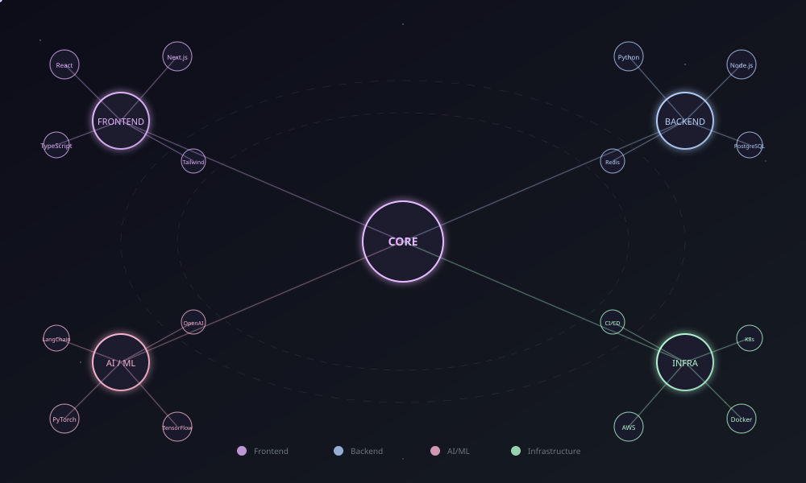
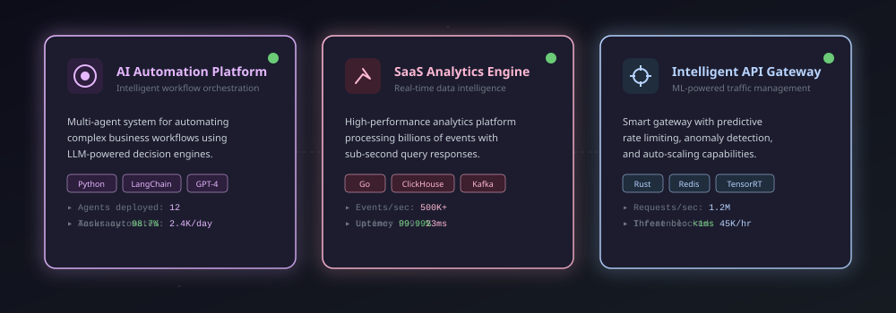
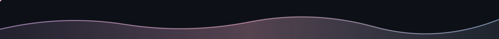

<!-- 
╔══════════════════════════════════════════════════════════════════════════════╗
║                                                                              ║
║   K A N C H I   K U M A R I   —   S Y S T E M   P R O F I L E               ║
║                                                                              ║
║   Full-Stack Engineer • AI/ML Developer • System Architect                  ║
║                                                                              ║
╚══════════════════════════════════════════════════════════════════════════════╝
-->

<!-- ═══════════════════════════════════════════════════════════════════════════
     HERO BANNER — Save as: assets/hero-banner.svg
     ═══════════════════════════════════════════════════════════════════════════ -->

  

<!-- ═══════════════════════════════════════════════════════════════════════════
     ANIMATED DIVIDER — CONSTELLATION LINE
     ═══════════════════════════════════════════════════════════════════════════ -->

  

<!-- ═══════════════════════════════════════════════════════════════════════════
     IDENTITY MATRIX — ANIMATED TYPING STATEMENT
     ═══════════════════════════════════════════════════════════════════════════ -->

  

 

<!-- ═══════════════════════════════════════════════════════════════════════════
     SYSTEM OVERVIEW — ABOUT SECTION
     ═══════════════════════════════════════════════════════════════════════════ -->

  

 

<!-- ═══════════════════════════════════════════════════════════════════════════
     TECH CONSTELLATION — SKILLS VISUALIZATION
     ═══════════════════════════════════════════════════════════════════════════ -->

<h2 align="center">
  
</h2>

  

 

<!-- ═══════════════════════════════════════════════════════════════════════════
     LIVE TELEMETRY — GITHUB STATISTICS
     ═══════════════════════════════════════════════════════════════════════════ -->

<h2 align="center">
  
</h2>

  

  
  
  

  

 

<!-- ═══════════════════════════════════════════════════════════════════════════
     ACTIVE SYSTEMS — FEATURED PROJECTS
     ═══════════════════════════════════════════════════════════════════════════ -->

<h2 align="center">
  
</h2>

  

 

<!-- ═══════════════════════════════════════════════════════════════════════════
     CONTRIBUTION GRAPH — ACTIVITY WAVE
     ═══════════════════════════════════════════════════════════════════════════ -->

  

  

 

<!-- ═══════════════════════════════════════════════════════════════════════════
     SIGNAL TRANSMISSION — CONTACT & PRESENCE
     ═══════════════════════════════════════════════════════════════════════════ -->

<h2 align="center">
  
</h2>

  

  
  &nbsp;
  
  &nbsp;
  
  &nbsp;
  

 

<!-- ═══════════════════════════════════════════════════════════════════════════
     FOOTER — SYSTEM SIGNATURE
     ═══════════════════════════════════════════════════════════════════════════ -->

  

  

<!--
╔══════════════════════════════════════════════════════════════════════════════╗
║                                                                              ║
║   End of README.md — SVG Assets Follow Below                                ║
║                                                                              ║
╚══════════════════════════════════════════════════════════════════════════════╝
-->
